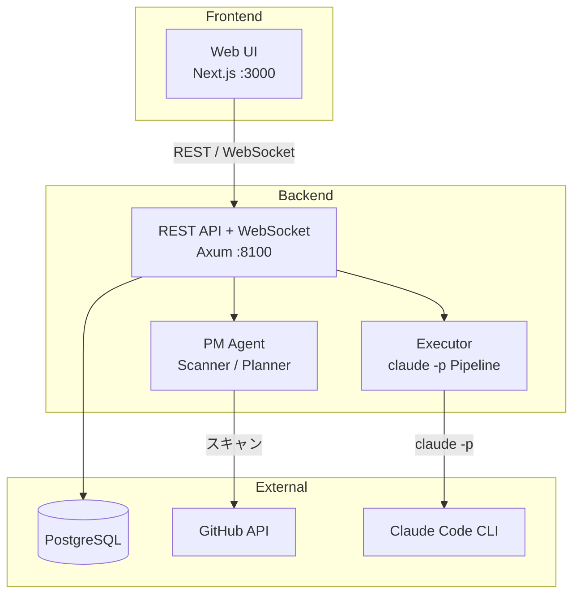
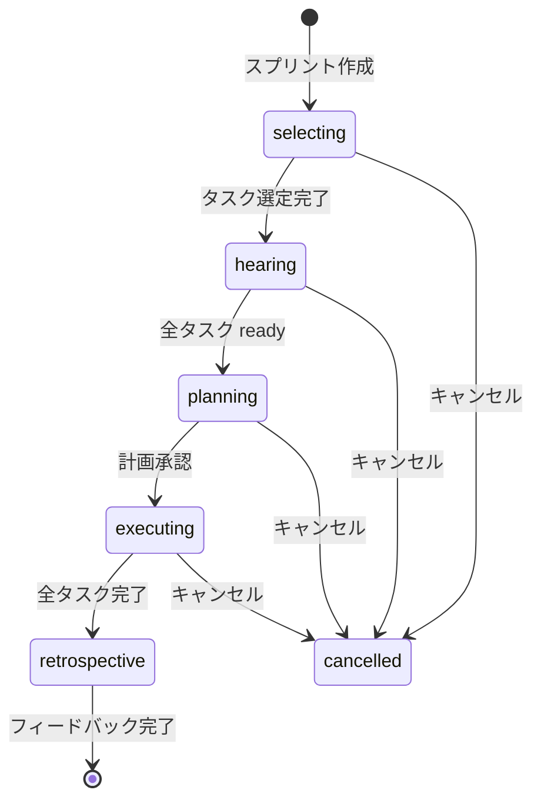

# ai-dev-team

PM Agent 主導の自律型開発チーム管理システム。スプリントサイクルでタスクを管理し、Claude Code CLI (`claude -p`) パイプラインで自動実行します。


## Features

- **スプリントサイクル** — selecting → hearing → planning → executing → retrospective の5フェーズでタスクを管理
- **claude -p パイプライン** — Planner → Coder → Reviewer → Test の自動実行パイプライン
- **WebSocket リアルタイム配信** — タスク実行・スキャン・スプリントの進捗をリアルタイム表示
- **GitHub 連携** — リポジトリスキャン・Issue/PR 連携によるタスク提案

## Architecture



### Sprint Cycle



## Tech Stack

| Layer | Technology |
|-------|-----------|
| Backend | Rust / Axum + SQLx |
| Frontend | Next.js 16 + Tailwind CSS v4 |
| Database | PostgreSQL 15+ |
| Execution | Claude Code CLI (`claude -p`) |
| Real-time | WebSocket (Axum built-in) |

## Prerequisites

- [Rust](https://www.rust-lang.org/tools/install) (latest stable)
- [Node.js](https://nodejs.org/) (v20+)
- [PostgreSQL](https://www.postgresql.org/) (v15+)
- [Claude Code CLI](https://docs.anthropic.com/en/docs/claude-code) (タスク実行に必要)

## Getting Started

### 1. Clone

```bash
git clone https://github.com/sode0417/ai-dev-team.git
cd ai-dev-team
```

### 2. PostgreSQL Setup

```bash
# macOS (Homebrew)
brew install postgresql@15
brew services start postgresql@15

# ユーザーと DB を作成
createuser -s ai_dev_team
psql -c "ALTER USER ai_dev_team WITH PASSWORD 'password';"
createdb -O ai_dev_team ai_dev_team
```

### 3. Database Migration

マイグレーションを順番に実行します:

```bash
psql -U ai_dev_team -d ai_dev_team -f backend/migrations/20260316000000_initial_schema.sql
psql -U ai_dev_team -d ai_dev_team -f backend/migrations/20260317000000_scan_sessions.sql
psql -U ai_dev_team -d ai_dev_team -f backend/migrations/20260317100000_hearing_flow.sql
psql -U ai_dev_team -d ai_dev_team -f backend/migrations/20260317200000_sprints.sql
```

### 4. Backend Setup

```bash
cd backend
cp .env.example .env
# .env を編集して DATABASE_URL のパスワードを設定
cargo run
```

Backend が http://localhost:8100 で起動します。

### 5. Frontend Setup

```bash
cd frontend
npm install
npm run dev
```

Frontend が http://localhost:3000 で起動します。

## Environment Variables

| Variable | Required | Description | Default |
|----------|----------|-------------|---------|
| `DATABASE_URL` | Yes | PostgreSQL 接続文字列 | — |
| `PORT` | No | Backend ポート番号 | `8100` |
| `GITHUB_TOKEN` | No | GitHub API トークン (スキャン機能に必要) | — |

## API Endpoints

### REST API

| Method | Path | Description |
|--------|------|-------------|
| `GET` | `/api/health` | ヘルスチェック |
| `GET` | `/api/dashboard` | ダッシュボード情報 |
| `GET/POST` | `/api/projects` | プロジェクト一覧 / 作成 |
| `GET/PUT/DELETE` | `/api/projects/{id}` | プロジェクト詳細 / 更新 / 削除 |
| `POST` | `/api/projects/{id}/scan` | スキャン開始 |
| `POST` | `/api/projects/{id}/sprints` | スプリント作成 |
| `GET` | `/api/projects/{id}/sprint/active` | アクティブスプリント取得 |
| `GET/POST` | `/api/tasks` | タスク一覧 / 作成 |
| `GET/PUT` | `/api/tasks/{id}` | タスク詳細 / 更新 |
| `POST` | `/api/tasks/{id}/execute` | タスク実行 |
| `POST` | `/api/tasks/{id}/hearing/answer` | ヒアリング回答 |
| `GET` | `/api/executions/{id}/logs` | 実行ログ取得 |

### WebSocket

| Path | Description |
|------|-------------|
| `/ws/executions/{task_id}` | タスク実行の進捗をリアルタイム配信 |
| `/ws/scans/{scan_id}` | スキャン進捗をリアルタイム配信 |
| `/ws/sprints/{sprint_id}` | スプリントイベントをリアルタイム配信 |

## Development

```bash
# Backend (ホットリロードなし)
cd backend && cargo run

# Frontend (ホットリロードあり)
cd frontend && npm run dev

# Lint (Frontend)
cd frontend && npm run lint
```

## License

This project is licensed under the MIT License - see the [LICENSE](LICENSE) file for details.
